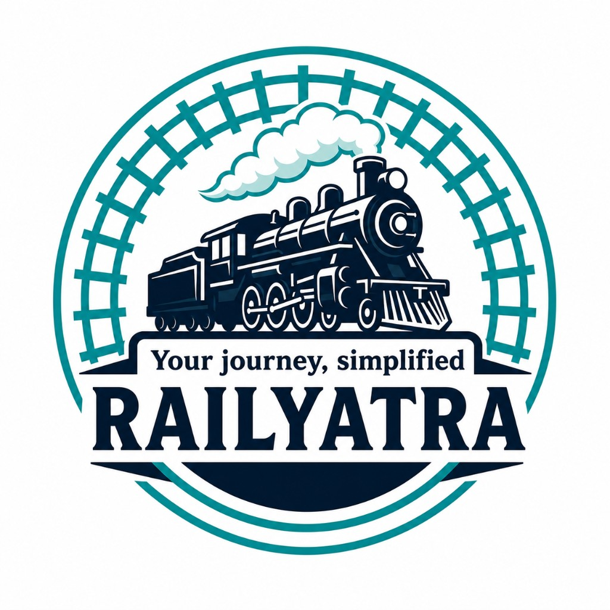
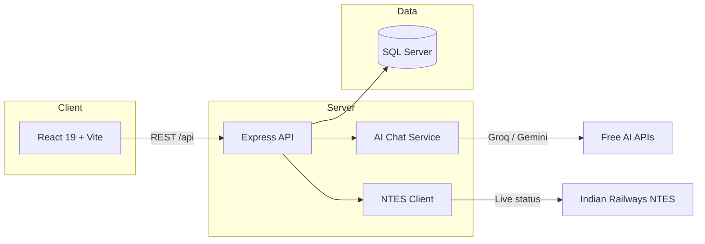

<div align="center">

# 🚆 RailYatra

**Your journey, simplified.** — A full-stack Indian railway reservation platform inspired by IRCTC.

[](#-live-demo)
[](https://react.dev/)
[](https://nodejs.org/)
[](https://www.microsoft.com/sql-server)
[](LICENSE)

[Live Demo](#-live-demo) · [Features](#-features) · [Quick Start](#-quick-start) · [API Docs](#-api) · [Deploy](#-deployment) · [GitHub](https://github.com/Ankit2004-web/RailYatra)

<br />



<br />

*Search trains · Book tickets · Track PNR · Live status · AI support*

</div>

---

## ✨ Highlights

| | |
|---|---|
| 🔍 **Route-aware search** | Finds trains that stop at **both** boarding and destination stations |
| 🎫 **End-to-end booking** | Seat map, Razorpay payments, e-ticket PDF, partial cancellation |
| 📡 **Live train status** | Real-time data from Indian Railways **NTES** |
| 🤖 **AI support chat** | Groq / Gemini powered live chat on the Support page |
| 🛡️ **Enterprise-ready** | JWT auth, MFA, RBAC, rate limits, audit logs, Swagger API |
| 📊 **Admin portal** | Dashboard, trains, bookings, users, reports, master data import |

---

## 🌐 Live Demo — 100% Free ($0)

Deploy from your **browser only** — no installs, **no payment**, **no Azure**:

| Step | Service | Cost |
|------|---------|------|
| 1 | [Render](https://dashboard.render.com) + GitHub | **$0** |
| 2 | [Vercel](https://vercel.com) + GitHub (optional) | **$0** |

SQLite database is **built in** — no separate DB signup needed.

**Guide:** [docs/DEPLOY.md](docs/DEPLOY.md)

| Resource | URL |
|----------|-----|
| **Local dev** | http://localhost:5000 |
| **API / Swagger** | `/api/swagger` on your deployed URL |
| **Deploy guide** | [docs/DEPLOY.md](docs/DEPLOY.md) |

---

## 🏗 Architecture



```
RailYatra/
├── frontend/          React 19 + Vite UI
├── backend/           Node.js + Express API
│   ├── routes/        REST endpoints
│   ├── services/      Business logic, AI chat, NTES
│   └── repositories/  Data access layer
├── database/          Schema, seeds, railway ETL importers
├── docs/              Architecture & deployment guides
└── Dockerfile         Container build (see deployment notes)
```

---

## 🚀 Quick Start

### Prerequisites

- **Node.js 20.x or 22.x LTS** (see `.nvmrc`) — Node 26+ is not supported by the SQL Server native driver
- **SQL Server LocalDB** (Windows) or SQL Server instance
- **ODBC Driver 17 for SQL Server**

### Install & run

```bash
# 1. Start LocalDB (Windows)
sqllocaldb start MSSQLLocalDB

# 2. Install dependencies
npm run install:all

# 3. Configure environment
copy backend\.env.example backend\.env

# 4. Create database + seed data
npm run db:setup

# 5. Start (builds React UI if needed)
npm start
```

Open **http://localhost:5000**

### Development (hot reload)

```bash
# Terminal 1 — API
npm run dev

# Terminal 2 — React dev server (proxies /api → :5000)
npm run frontend:dev
```

Open **http://localhost:5173**

---

## 🎯 Features

### Passenger

- Station & train autocomplete, route-aware search, filters
- Interactive seat map, quotas (General, Ladies, Senior Citizen)
- PNR enquiry, e-ticket PDF, My Bookings
- Live train status (NTES), fare estimates (IRCTC CC 11/2025)
- Support hub — FAQ, AI live chat, raise ticket
- MFA, OAuth dev login, saved passengers, i18n hooks

### Admin

- Unified dashboard with stats & teal enterprise UI
- Train / station / booking / user management
- Revenue, occupancy & cancellation reports
- Master data import (DataMeet ~5k trains)
- Audit trail, RBAC roles

### AI Support Chat

Add a free API key to `backend/.env`:

```env
GROQ_API_KEY=gsk_...          # https://console.groq.com/keys
# or
GEMINI_API_KEY=...            # https://aistudio.google.com/apikey
```

Restart the server → **Support → Live Chat** shows **AI Support Assistant**.

---

## ⚙️ Environment

```env
DB_SERVER=(localdb)\MSSQLLocalDB
DB_NAME=RailwayReservation
DB_TRUSTED_CONNECTION=true
JWT_SECRET=your_secret_key
PORT=5000
APP_URL=http://localhost:5000

ADMIN_EMAIL=admin@railway.com
ADMIN_PASSWORD=Adm!n@2004#Hyd

# AI support (optional — free tier)
AI_CHAT_PROVIDER=auto
GROQ_API_KEY=
GROQ_MODEL=llama-3.1-8b-instant
GEMINI_API_KEY=
GEMINI_MODEL=gemini-2.0-flash
```

See `backend/.env.example` for Razorpay, SMTP, and rate-limit options.

---

## 📡 API

Interactive docs: **http://localhost:5000/api/swagger**

| Method | Endpoint | Access |
|--------|----------|--------|
| `POST` | `/api/auth/register` · `/api/auth/login` | Public |
| `GET` | `/api/trains/search` · `/api/stations/search` | Public |
| `GET` | `/api/bookings/pnr/:pnr` | Public |
| `GET` | `/api/live-trains/:trainNumber` | Public |
| `POST` | `/api/bookings` · `/api/payments/*` | Private |
| `POST` | `/api/support/chat/:sessionId` | Private (AI chat) |
| `GET` | `/api/admin/dashboard` · `/api/admin/reports/*` | Admin |

Full endpoint list in Swagger UI.

---

## 🛠 Scripts

| Command | Description |
|---------|-------------|
| `npm start` | Production server |
| `npm run dev` | API with nodemon |
| `npm run frontend:dev` | Vite dev server |
| `npm test` | Backend tests |
| `npm run db:setup` | Schema + seed |
| `npm run import:datameet` | Bulk import ~5k trains (~7 min) |
| `npm run download:railway` | Download DataMeet JSON dataset |

---

## 🌍 Deployment — $0 / month

**No money needed.** Browser-only setup:

1. **[Render](https://dashboard.render.com)** — connect GitHub → Blueprint → done (SQLite built in)
2. **[Vercel](https://vercel.com)** (optional) — import `frontend/` for a portfolio URL

Full guide: **[docs/DEPLOY.md](docs/DEPLOY.md)**

---

## 📦 Railway master data (optional)

```bash
npm run download:railway    # DataMeet JSON (CC0, ~2016 era)
npm run import:datameet     # ~8,988 stations · ~5,207 trains · ~417k stops
```

Import report: `database/data/railway/RailwayDataImportReport.json`

---

## 🧪 Testing

```bash
npm test
```

Includes API integration tests, fare rules, NTES parser, and AI chat fallback tests.

---

## 📄 License

MIT — see [LICENSE](LICENSE).

---

<div align="center">

**Built with ❤️ for Indian Railways enthusiasts**

[⭐ Star on GitHub](https://github.com/Ankit2004-web/RailYatra) · [Report an issue](https://github.com/Ankit2004-web/RailYatra/issues)

</div>
