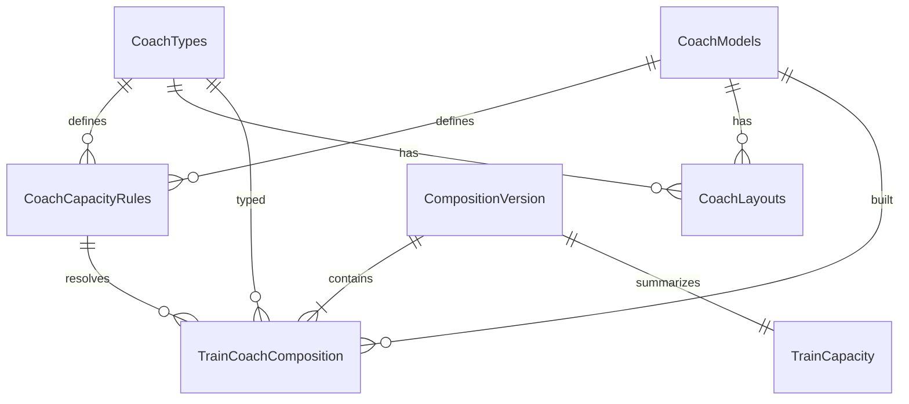

# RailYatra Coach Composition & Seating Capacity System

Production-ready coach rake management with **model-based exact capacity rules** and **official composition import only**.

## Architecture

```
CoachModels ──┐
              ├── CoachCapacityRules (official IR specs: type × model → berths/seats)
CoachTypes ───┤
              └── CoachLayouts (berth arrangement metadata)

CompositionVersion (rake snapshot history, validFrom/validTo)
       │
       ├── TrainCoachComposition (per-coach: B1, S4, HA1, GS, PC, EOG…)
       └── TrainCapacity (aggregated totals)
```

## Database Tables

| Table | Purpose |
|-------|---------|
| `CoachModels` | ICF, LHB, VB, Train18, MEMU, DEMU, DD, JS |
| `CoachTypes` | HA, A, B, G, EA, E, C, S, D, GS, PC, SLR, EOG, PAR |
| `CoachCapacityRules` | Exact capacity per type+model (from IR classification) |
| `CoachLayouts` | Berth/seat arrangement descriptions |
| `CompositionVersion` | Version history when rake changes by date |
| `TrainCoachComposition` | Per-train per-coach rake data |
| `TrainCapacity` | Aggregated AC/Sleeper/Chair/General/Reserved totals |

## Capacity Policy

1. **Never invent per-train capacities** — each coach gets capacity from `CoachCapacityRules` lookup.
2. **If composition not imported** → `capacityStatus: Unknown`, all totals `null`.
3. **If model unknown for a coach** → `capacityKnown: false`, capacities `null`.
4. **Partial rake** → `capacityStatus: Partial`.

### Official IR Rules (seeded)

| Type | Model | Seats | Berths |
|------|-------|-------|--------|
| HA (1A) | LHB/ICF | — | 24 (2 coupe + 6 cabin) |
| A (2A) | LHB | — | 54 |
| A (2A) | ICF | — | 46 |
| B (3A) | LHB | — | 72 |
| B (3A) | ICF | — | 64 |
| G (3E) | LHB | — | 78 |
| EA | LHB | 50 | — |
| E (EC) | LHB | 56 | — |
| C (CC) | LHB/ICF | 73 | — |
| S (SL) | LHB | — | 78 |
| S (SL) | ICF | — | 72 |
| GS/UR | LHB | 99 | — |
| GS/UR | ICF | 90 | — |
| E/C | VB | 44/78 | — |

## Setup

```bash
npm run db:sync                  # Apply schema-railway-coaches.sql
npm run db:seed-coach-rules      # Seed models, types, rules, layouts
```

## Import Official Composition

Place licensed rake CSV at `data/railway/processed/coach_composition.csv` (see `.example` for format):

```bash
npm run import:coach-composition
```

CSV columns: `trainNumber, coachNumber, coachTypeCode, coachModelCode, coachPosition, flags…`

## API Endpoints

### Node.js (port 5000) & .NET (port 5080)

| Method | Endpoint | Description |
|--------|----------|-------------|
| GET | `/api/train/{trainNo}/coaches` | Full rake with per-coach capacity |
| GET | `/api/train/{trainNo}/capacity` | Aggregated train totals |
| GET | `/api/train/{trainNo}/layout` | Berth/seat layout per coach |

### Example Response (no composition imported)

```json
{
  "trainNumber": "12951",
  "capacityStatus": "Unknown",
  "coachCount": 0,
  "coaches": [],
  "message": "Official coach composition not imported"
}
```

## ER Diagram



## Data Sources

| Source | Composition | Status |
|--------|-------------|--------|
| Official IR rake diagrams / COA data | Per-train coaches | Manual CSV import |
| DataMeet JSON | Timetable only | **No coach composition** |
| IR coach classification docs | Capacity rules | Seeded in `CoachCapacityRules` |

## Validation

- Import validates coach type and model codes against reference tables.
- Capacity resolved via rule lookup; missing rule → `capacityKnown = false`.
- Version history via `CompositionVersion`; old versions deactivated on new import.
- Changing rules by date supported via `CoachCapacityRules.effectiveFrom/To`.
