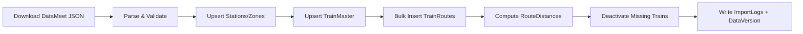
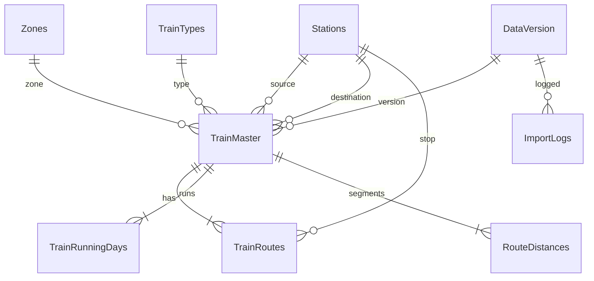

# RailYatra Master Data Import System (.NET)

Production-ready ASP.NET Core master data pipeline for Indian Railways timetable import, validation, storage, and search.

## Architecture

```
src/
├── RailYatra.Api/              ASP.NET Core Web API (Swagger, Hangfire dashboard)
├── RailYatra.Application/      Query services, DTOs
├── RailYatra.Domain/           Entities, repository interfaces
├── RailYatra.Infrastructure/   EF Core, ETL, repositories, Hangfire jobs
└── RailYatra.Tests/            xUnit tests
```

## Database Tables

| Table | Purpose |
|-------|---------|
| `Stations` | Station master (shared with Node booking app) |
| `Zones` | Railway zones |
| `TrainTypes` | RAJ, SHAT, SF, EXP, etc. |
| `TrainMaster` | Train identity, endpoints, times, flags |
| `TrainRoutes` | Full stop sequence per train |
| `TrainRunningDays` | Mon–Sun running pattern |
| `RouteDistances` | Segment distances between consecutive stops |
| `DataVersion` | Timetable snapshot history |
| `ImportLogs` | ETL audit trail |

Schema: `database/schema-railway-etl.sql` (applied via `npm run db:sync`).

## Data Sources (configured — no fake data)

| Priority | Source | Status |
|----------|--------|--------|
| 1 | [data.gov.in OGD](https://www.data.gov.in/catalog/indian-railways-train-time-table) | Configured in `Ogd` section — enable when API key/resource available |
| 2 | [DataMeet railways CC0](https://github.com/datameet/railways) | **Active importer** (~5200 trains, ~2016 era) |

Fields not present in source (running days, platforms, per-stop distance) are stored as **NULL** — never fabricated.

## API Endpoints

| Method | Endpoint | Description |
|--------|----------|-------------|
| GET | `/api/trains?page=1&pageSize=50` | Paginated active trains |
| GET | `/api/train/{trainNo}` | Train details |
| GET | `/api/train/{trainNo}/route` | Full route stops |
| GET | `/api/station/{stationCode}` | Station details |
| GET | `/api/search?from=NDLS&to=MMCT&date=2026-08-01` | Search between stations |
| GET | `/api/search/date?from=&to=&date=` | Date-filtered search |
| GET | `/api/search/running?from=&to=&day=Monday` | Day-of-week search |
| POST | `/api/import/full` | Full ETL import |
| POST | `/api/import/incremental` | Hash-based incremental import |
| GET | `/api/import/logs` | Import history |

Swagger UI: http://localhost:5080/swagger  
Hangfire dashboard: http://localhost:5080/hangfire

## Quick Start

### Prerequisites

- .NET 10 SDK
- SQL Server or LocalDB
- Node.js (for shared `db:sync`)

### 1. Apply database schema

```bash
npm run db:sync
```

### 2. Run the .NET API

```bash
cd src
dotnet run --project RailYatra.Api
```

### 3. Import timetable data

```bash
curl -X POST http://localhost:5080/api/import/full
```

Or use existing Node importer first, then run .NET import to populate `TrainMaster`/`TrainRoutes`.

## ETL Pipeline



Features:
- Transaction-wrapped imports
- EFCore.BulkExtensions for route inserts
- SHA-256 hash for incremental detection
- Scheduled updates via Hangfire (`EnableScheduledImport: true`)

## ER Diagram



## Deployment

1. Set `ConnectionStrings:RailwayDb` in production config or environment variables.
2. Run `npm run db:sync` against production SQL Server.
3. Publish: `dotnet publish src/RailYatra.Api -c Release -o ./publish`
4. Host behind IIS or Kestrel reverse proxy.
5. Enable scheduled import in `appsettings.Production.json`:
   ```json
   "RailwayImport": { "EnableScheduledImport": true, "ScheduleCron": "0 2 * * 0" }
   ```

## Coexistence with Node.js API

- Node API (port 5000): booking, auth, payments, legacy search
- .NET API (port 5080): master data import and canonical timetable search
- Both share `RailwayReservation` SQL Server database

## Tests

```bash
cd src
dotnet test
```
